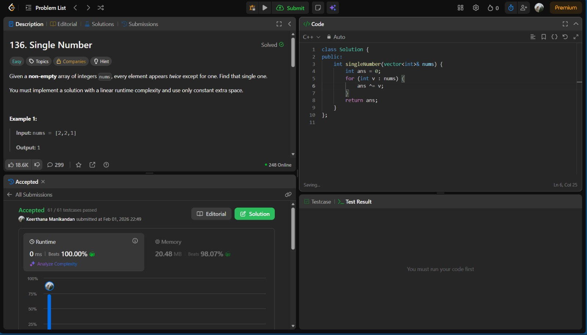

# LeetCode Problem 136: Single Number



## Problem Statement
Given a **non-empty** array of integers `nums`, every element appears **twice** except for one. Find that single one.

You must implement a solution with linear runtime complexity and use only constant extra space.

### Example
- **Input:** nums = [2, 2, 1]
- **Output:** 1

## Solution Explanation
This problem can be solved efficiently using the XOR (^) bitwise operator. The key properties of XOR are:
- `a ^ a = 0` (any number XOR itself is 0)
- `a ^ 0 = a` (any number XOR 0 is the number itself)
- XOR is commutative and associative

### Step-by-Step Procedure
1. **Initialize a variable** `ans` to 0. This will hold the result.
2. **Iterate through each number** in the array `nums`.
3. **Apply XOR** between `ans` and the current number. Update `ans` with the result.
4. **After the loop**, `ans` will contain the single number that does not have a duplicate.

### Why XOR Works
- All numbers that appear twice will cancel each other out because `a ^ a = 0`.
- The number that appears only once will remain because `0 ^ single_number = single_number`.

## C++ Implementation
```cpp
class Solution {
public:
    int singleNumber(vector<int>& nums) {
        int ans = 0;
        for (int v : nums) {
            ans ^= v;
        }
        return ans;
    }
};
```

## Performance
- **Time Complexity:** O(n) — Each element is visited once.
- **Space Complexity:** O(1) — Only a single integer variable is used.

## Summary
This approach is optimal for the problem, leveraging bitwise operations to achieve both linear time and constant space. The solution is simple, elegant, and highly efficient.

---

*This README was generated to provide a clear, step-by-step explanation of the solution for LeetCode Problem 136: Single Number.*
